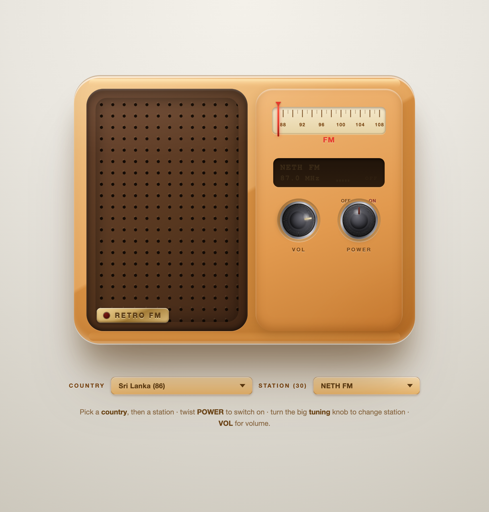

# Retro FM : a skeuomorphic web radio 📻

A single-file, dependency-free **internet radio player** styled as a photorealistic vintage FM receiver.
Pick a country, slide across the dial, and stream live radio from anywhere in the world — all rendered
with hand-crafted CSS, a little SVG, and vanilla JavaScript.

> Everything lives in one self-contained [`index.html`](index.html). No build step, no framework, no npm.



---

## ✨ Features

- **Skeuomorphic design** — a warm, tactile retro radio built entirely in CSS: layered shadows and
  gradients, a perforated speaker grille, an embossed brass nameplate, an amber LCD, and three
  knurled metal knobs (tuning, volume, power) sitting in brushed-metal collars.
- **Real internet radio** — streams live stations via the free, open
  [Radio Browser API](https://www.radio-browser.info/) and the HTML5 `<audio>` element.
- **Country → Station pickers** — choose from **240+ countries** (with per-country station counts),
  then pick from that country's stations in a dropdown. Sri Lanka ships as the default curated list.
- **Interactive controls**
  - Drag/tap the **tuning slider** (a slide-rule dial) to sweep across stations — the needle snaps to the nearest one.
  - Turn the **VOL** knob to set volume.
  - Twist **POWER** to switch on/off (the LCD lights up, the on-air LED glows).
- **Motion & life** — animated dial needle, a "breathing" warm glow through the grille while playing,
  and a **live equalizer** whose five bars dance independently like a real audio meter.
- **Synthesized sound effects** — retro *clunk* on power on/off and mechanical **detent ticks** while
  turning the knobs, all generated on the fly with the **Web Audio API** (no sound files).
- **Accessible & resilient** — keyboard-tunable, respects `prefers-reduced-motion`, and falls back to a
  curated station list if the API is unreachable.

---

## 🚀 Running it

It's just a static HTML file, so any of these work:

```bash
# 1. Open it directly
open index.html            # macOS  (or double-click the file)

# 2. Or serve it locally (recommended — see note on http below)
python3 -m http.server 5177
# then visit http://localhost:5177
```

**Note on mixed content:** some stations stream over plain `http://`. Browsers block `http` audio on a
page served over `https`, so run the radio from a local `http://` server (or `file://`) for the widest
station compatibility. The many `https` streams work everywhere.

---

## 🌐 Hosting it

| Host | Setup | Which stations play |
|------|-------|---------------------|
| **Local** (`http://`) | `python3 server.py` | **All** stations (http + https) |
| **GitHub Pages** (`https://`) | push & enable Pages | **https-only** — the app auto-filters the list to playable streams |
| **Vercel** (`https://`) | import the repo (zero config) | **All** stations — an edge proxy relays http streams over https |

**Full station support on the web → deploy to Vercel.** This repo includes a tiny edge function at
[`api/stream.js`](api/stream.js). When the site is served from a host that provides it (Vercel and
similar), the app automatically routes `http://` streams through `/api/stream?url=…`, so the browser
sees only `https` and plays them. On GitHub Pages (no server) the app falls back to https-only.

```bash
# one-time: import the GitHub repo at vercel.com → New Project → Deploy
# (or from the repo:)
npm i -g vercel && vercel
```

> Caveats: proxied audio flows through the edge function, so free-tier **bandwidth/duration limits**
> apply, and a few Shoutcast/ICY streams may still not proxy cleanly. Most http stations will work.

---

## 🎛️ How to use

1. **COUNTRY** dropdown → choose a country. Its stations load into the **STATION** dropdown and onto the dial.
2. **STATION** dropdown (or the tuning slider) → choose a station.
3. Twist **POWER** to start playing. Use **VOL** to adjust the volume.

---

## 🛠️ Tech

| Piece            | What it does                                                            |
|------------------|-------------------------------------------------------------------------|
| HTML/CSS         | The entire radio — grille, dial, knobs, LCD — is CSS gradients & shadows |
| SVG              | The tuning dial's tick marks and frequency scale                        |
| Vanilla JS       | Knob dragging, tuning logic, playback, country/station loading          |
| Web Audio API    | Synthesized UI sound effects (power, ticks) — no audio assets           |
| Radio Browser API| Live directory of countries and stations                                |
| HTML5 `<audio>`  | Plays the actual stream                                                  |

Because internet streams have no real broadcast frequency, each station is assigned an evenly-spaced
position on the 87–108 MHz dial so the tuning slider stays meaningful.

---

## 📝 Background

A browser-based, design-focused take on the classic tabletop FM radio. It went through several looks
(a synthwave 3D-grid version and a Three.js monochrome model among them) before settling on this clean,
warm, all-CSS retro radio.

---

## 🙏 Credits & acknowledgements

- **[Radio Browser](https://www.radio-browser.info/)** — the free, community-run directory that powers
  the country and station lists.
- Inspiration: classic 1970s tabletop FM radios.

## License

MIT — do whatever you like.
